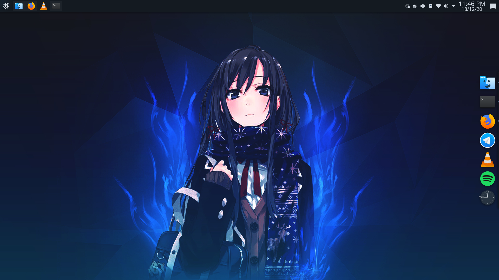

# Arch Linux Installation
***
## Simple Arch Linux Installation  (according to me )

## INSTALLATION

**SET FONT BIGGER**
* setfont /usr/share/kbd/consolefonts/sun12x22.psfu.gz

**CHECK UEFI IS ENABLE OR NOT**
* ls /sys/firmware/efi/efivars

**CHECK WIFI ROUTER IS SHOWN OR NOT**
* ip link

**CONNECT USING WIFI**
* iwctl
* station wlan0 connect "(Your Wi-Fi SSID)"
* (enter password of your SSID)
* exit

**CHECK INTERNET IS WORKING OR NOT**
* ping -c 4 google.com

**DISK PARTITION**
* fdisk -l  (List Down Partiton)
* fdisk /dev/sdb or /dev/sda  (Get Into the Partition)            
* n  (add a new partition)                          
* first sector (DEFAULT)      
* last sector  (+512M)                               
* t  (change a partition type)                        
* set 1   (Here 1 Stands for EFI SYSTEM, Press L to list down all available partition)               
* n  (add a new partition)                        
* first sector (DEFAULT)
* last sector  (+40G)         
* n  (add a new partition)                         
* first sector (DEFAULT)
* last sector  (+50G)         
* n  (add a new partition)                         
* first sector (DEFAULT)
* last sector  (DEFAULT)
* t  (change a partition type)                        
* set 19   (Here 19 Stands for LINUX SWAP, Press L to list down all available partition)                   
* p  (print the partition table)                        
* w  (write table to disk and exit)                          
*  **(PLEASE TRIPE CHECK YOUR PARTITION THEN RUN THIS COMMAND AS THERE IS HIGN CHANGE THAT YOU RUINED YOUR DISK)**

|Name|Partition|Size|Type|
|----|---------|----|----|
|sdb4|/efi     |512M|EFI |
|sdb5|/        |64G |ext4|
|sdb6|swap     |16G |swap|
|sdb7|home     |(Remaining Space)|ext4|

**FORMAT PARTITION**
* mkfs.fat -F32 -n EFI /dev/sdb4
* mkfs.ext4 /dev/sdb5 
* mkfs.ext4 /dev/sdb6 
* mkswap /dev/sdb7 
* swapon /dev/sdb7

**MOUNT PARTITION**
* mount /dev/sdb5 /mnt
* mount /dev/sdb6 /mnt/home
* mkdir /mnt/efi
* mount /dev/sda2 /mnt/efi  (NOTE HERE SDA2 IS WINDOWS EFI PARTITION)

**INSTALL BASIC LINUX BASE PACKAGES**
* pacstrap /mnt base linux linux-firmware

**GENERATE FSTAB**
* genfstab -U /mnt >> /mnt/etc/fstab

**IN /MNT ROOT DIRECTORY**
* arch-chroot /mnt
* pacman -Sy nano
* nano /etc/locale.gen  (UNCOMMENT en_IN )
* locale-gen
* echo "LANG=en_IN.UTF-8" > /etc/locale.conf
* ln -sf /usr/share/zoneinfo/Asia/Kolkata /etc/localtime
* timedatectl set-ntp true
* timedatectl status
* hwclock --systohc
* date
* echo "Your Hostname" > /etc/hostname
* nano /etc/hosts, Add the Following hosts

|IP       |HOSTNAME | |
|---------|---------|-|
|127.0.0.1|localhost| |
|::1      |localhost| |
|127.0.1.1|"Your Hostname".localdomain|"Your Hostname"|

* passwd
* useradd -G wheel,audio,video -m "any user"
* passwd "any user"
* pacman -S sudo
* EDITOR=nano visudo  (UNCOMMENT ##% wheel All=(All)All)
* pacman -Sy netctl networkmanager dialog dhcpcd wpa_supplicant ifplugd
* pacman -S grub efibootmgr os-prober networkmanager
* grub-install --target=x86_64-efi --efi-directory=/efi/ --bootloader-id=GRUB
* grub-mkconfig -o /boot/grub/grub.cfg
* systemctl enable NetworkManager
* exit

**UNMOUNT OUR DISK PARTITION**       
* umount /mnt
* unmount /mnt/home
* umount /mnt/efi
* reboot

**RESTART AND INSTALL KDE PLASMA**   
* setfont /usr/share/kbd/consolefonts/sun12x22.psfu.gz
* nmtui-connect
* pacman -S xorg plasma plasma-wayland-session kde-applications konsole firefox
* systemctl enable sddm
* reboot

**YOUR ARCH LINUX IS READY**
* (CREATE READ AND WRITE PERMISSION)
* pacman -S ntfs-3g
* blkid /dev/sda  (COPY UUID OF DRIVE)
* mkdir "Your Hostname" /  (MAKE A DIRECTORY IN ROOT)
* (edit fstab /etc/fstab)
* UUID=################  >>  /"Your Hostname"  >>  ntfs-3g  >>  defaults  >>  0 2  
      
* **(PLEASE NOTE: DISABLE YOUR WINDOWS 10 FAST BOOT TO ENABLE READ WRITE PERMISSION REGULARLY)**

### INSTALL ADDITIONAL PACKAGES OF ARCH LINUX**   
* install yay, yaourt,git etc

_Author : Vikas Anand_
      
      
      
      
      
   
   
   
   
   
   
   
   
   
   
   
   
   
   
   

